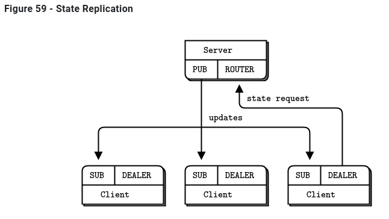

# Topology: State Replication (Advanced Pub-Sub Pattern) 

* Brokers: 
  * Sockets (both perform "bind"): 
    * PUB socket: To broadcast the replicas' states
    * ROUTER socket: To receive the replicas' states that need broadcast
  * Allows easy integration of new servers. 
  * Using a ROUTER socket to receive state allows replication of the broker for load balancing and fault tolerance. 
* Session servers:
  * Sockets:
    * DEALER socket: Connects to brokers' ROUTER socket. Used to send the full state of required state-based CRDTs (2x ORSets)
    * SUB socket: Connects to brokers' SUB socket. Subscribes with "", i.e., subscribes everything.
  * By using this setup, we can easily broadcast the state updates to every server.
